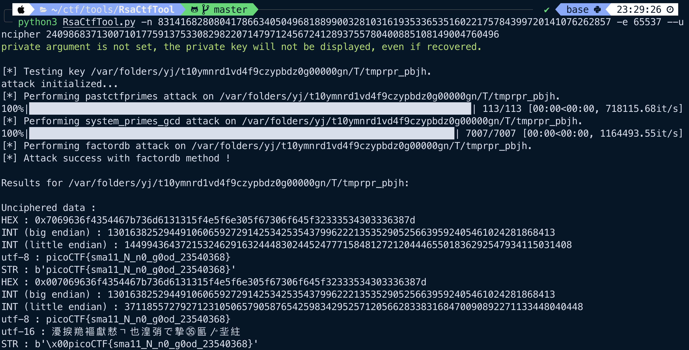

# Mind Your Ps and Qs
> Cryptography

### Description
> In RSA, a small e value can be problematic, but what about N? Can you decrypt this?
>
> [values](https://mercury.picoctf.net/static/38f30029ab93478310e906d3d084a4c1/values)
>
> **Hint 1: Bits are expensive, I used only a little bit over 100 to save money.**

### Solution
This seems to be a simple problem of decrypting the given ciphertext c by using the given n and e values. An easy way to approach this is using a tool called [RsaCtfTool](https://github.com/RsaCtfTool/RsaCtfTool) and feeding in all the given values.


However, what if we want to solve this without the help of a tool? Well, according to Wikipedia's entry on RSA, we can use the following function to find the plaintext:
`m(c) = c^d mod n`
Of these, we have `c` and `n` and only need to find `d`. We can find `d` via the following:

```
d = e(mod * totient(n)), totient(n) = lcm(p-1,q-1)
```

Which means we need to find the prime factors of n. Using factordb, a database of prime factors, we can find the p and q values that make up our n. Then, we can calculate... (TODO: Will come back to this, feel like moving on for now)

### Flag
`picoCTF{sma11_N_n0_g0od_23540368}`

### Helpful Resources
- https://ctftime.org/writeup/26977
