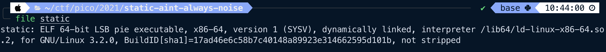
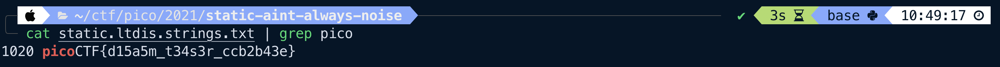

# Static Ain't Always Noise
> General Skills

### Description
> Can you look at the data in this binary: [static](https://mercury.picoctf.net/static/ff4e569d6b49b92d090796d4631a2577/static)? This [BASH script](https://mercury.picoctf.net/static/ff4e569d6b49b92d090796d4631a2577/ltdis.sh) might help!

### Solution
We're given 2 files: a binary and a bash script. Running file on the binary:

We can see that it's just an ELF 64-bit executable.  Looking at the given bash script, `ltdis.sh`, it appears to simply output the .text section of a binary, then parse it for strings. If we run `ltdis.sh` on static we end up with 2 files: `static.ltdis.x86\_64.txt` and `static.ltdis.strings.txt`.

If we grep for "pico" in the strings file, we arrive at the flag.

### Flag
`picoCTF{d15a5m_t34s3r_ccb2b43e}`
