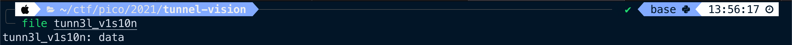
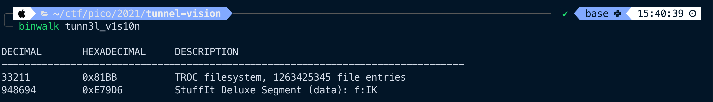
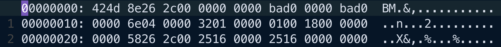
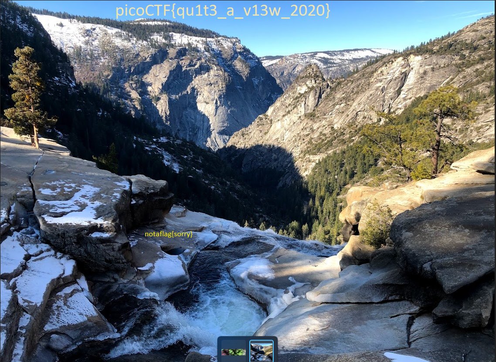

# tunn3l v1s10n
> Forensics

### Description
> We found [this](https://mercury.picoctf.net/static/d0129ad98ba9258ab59e7700a1b18c14/tunn3l_v1s10n) file. Recover the flag.
>
> **Hint 1: Weird that it won't display right...**

### Solution
Immediately upon looking at the name of this challenge, there might be some false positives involved. The hint also seems to indicate that this may be a challenge of adjusting or tweaking the file in some manner in order to get the data to display correctly.

So with that initial information in mind, let's run file on the given file to see what we're up against:

Okay... data. Super helpful. Cat'ing out the file doesn't reveal much either, just some gibberish. My first thought is to use binwalk to see if there are some embedded files in here:

That's interesting, it seems there might be an embedded file system within the file. Now, we could go digging into this, but the hint seems to indicate the file as it is, is what we want, but that something is preventing it from displaying right.

Let's look at the hex view of the file and see if we can recognize some magic bytes:

Okay! It seems this might be a BMP file. Adding .bmp extension to the file doesn't allow us to open the file.

Let's see if we can parse out some header information and confirm this is a bitmap image. According to wikipedia, the first 2 bytes should be `0x42 0x4d` (BM in ASCII), so check. The next 4 bytes represent the size of the file in bytes. Taking 0x8e262c00and converting that to decimal (using little endian) gives us 2,893,454 bytes. Let's see if this matches with the size of the file given by `ls -lh`.

*Note: When reading ASCII, we are reading individual bytes. Endianess does not matter. When reading a sequences of bytes to be interpreted as a value, these are read as a whole and must use little/big endian.*

It seems that `ls` is rounding down, but otherwise, the values match. This pretty much confirms that this file is a bitmap image, probably with some distorted information causing it not to render when opened.

Let's parse out of the rest of the header:

It seems off that the image data offset and the DIB header size are the same values. Looking more into wikipedia, the DIB header size should actually have a decimal value of 40. Editing that to be 0x2800, we now get the following:

Still not enough. Another piece that stuck out to me is the offset, which is the starting location of the bitmap image data. It seems rather high. How much information could there be before the pixel image data (pixel array) is found? Perhaps this offset is incorrect?

If we change the offset to be 54 (14 for header, 40 for DIB), then we get another image that still says "notaflag{sorry}".

Perhaps there's other metadata that could be causing issues? The image seems rather thin, maybe we can adjust the height?

And there it is!

### Flag
`picoCTF{qu1t3_a_v13w_2020}`
