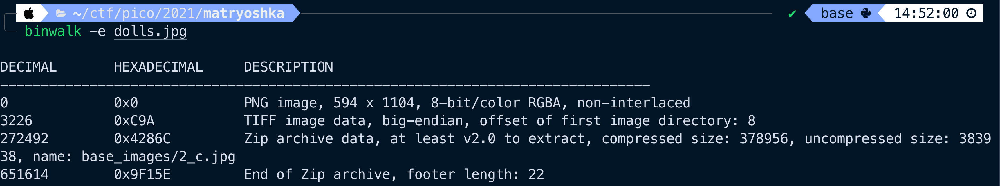

# Matryoshka Doll
> Forensics

### Description
> Matryoshka dolls are a set of wooden dolls of decreasing size placed one inside another. What's the final one?
>
> Image: [this](https://mercury.picoctf.net/static/5eb456e480e485183c9c1b16952c6eda/dolls.jpg)
> 
> **Hint 1: Wait, you can hide files inside files? But how do you find them?**
>
> **Hint 2: Make sure to submit the flag as `picoCTF{XXXXX}`.**

### Solution
Based on the challenge name and the hints, it would seem this is a steg problem, where the flag is hidden inside a file, hidden inside the image. A great starting point with finding embedded information in binary files is by using a tool called `binwalk`.

Using binwalk we can see that there is indeed a hidden image inside this image:

Using `binwalk` to extract the image, we can see that this image too has a hidden image. Therefore, we should should continue pulling out the hidden images, recursively, until we reach some sort of end.

After repeating this action a few times, we arrive at an extracted `flag.txt` file, which when cat'd out, reveals the flag!

### Flag
`picoCTF{336cf6d51c9d9774fd37196c1d7320ff}`
