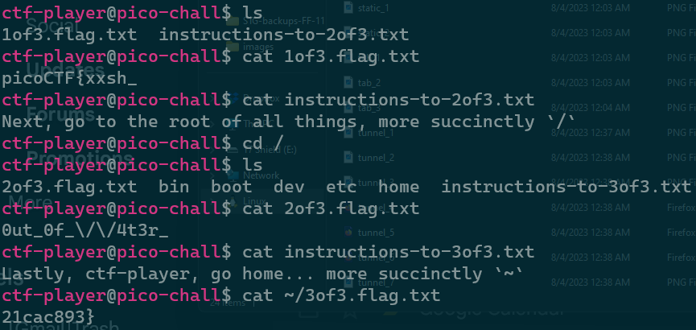

# Magikarp Ground Mission
> General Skills

### Description
> Do you know how to move between directories and read files in the shell? Start the container, `ssh` to it, and then `ls` once connected to begin. Login via `ssh` as `ctf-player` with the password, `abcba9f7`
>
> Additional details will be available after launching your challenge instance.
>
> **Hint 1: Finding a cheatsheet for bash would be really helpful!**

### Solution
Connecting to the server via `ssh` and running `ls` shows us 2 files: one that contains a third of the flag, and another of the next location. This pattern repeates until the flag is found.

### Flag
`picoCTF{xxsh_0ut_0f_\/\/4t3r_21cac893}`
