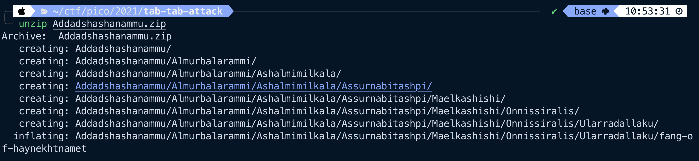
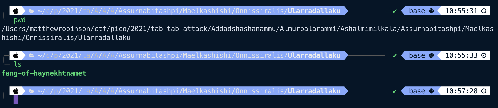

# Tab, Tab, Attack
> General Skills

### Description
> Using tab-complete in the Terminal will add years to your life, esp. when dealing with long rambling directory structures and filenames: [Addadshashanammu.zip](https://mercury.picoctf.net/static/3afd18a65e42b80526aa87f9766c588b/Addadshashanammu.zip).

### Solution
First, we unzip `Addadshashanammu.zip`:

We can see it inflated a number of nested directories. Using `cd` (along with tab-complete, as the challenge seems to want to teach us), we arrive at the final nested directory:

It's a binary file! Let's try a simple `strings` command and grep for the flag:

### Flag
`picoCTF{l3v3l_up!_t4k3_4_r35t!_d32e018c}`
