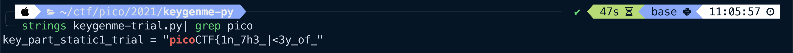
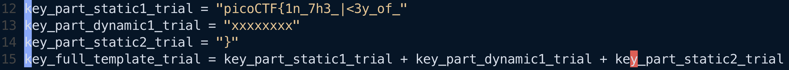
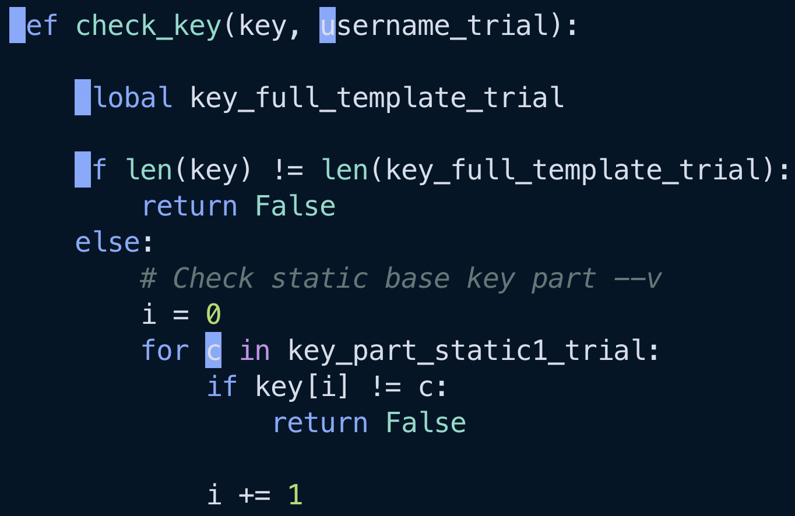
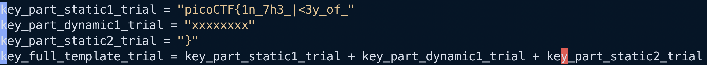
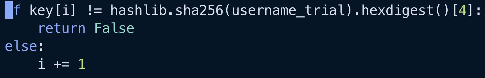
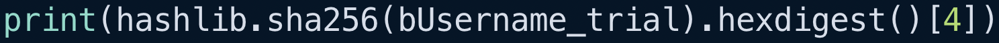

# Keygenme-py
> Reverse Engineering

### Description
> [keygenme-trial.py](https://mercury.picoctf.net/static/b016c61bd2cc0be05a59da1dde67a2ac/keygenme-trial.py)

### Solution
We're given a python file and nothing else for this challenge. The first thing I did was to run strings on the file to see if I could cheese the challenge:

Interesting, it appears as if a partial part of the flag is already written into the program. Let's open it up and make sure we can't find the entire flag.

Alright, so it seems we have 3 parts to the flag within this file: 2 static and 1 dynamic. The key (no pun intended) to solving this challenge probably means finding out what those xxxxxxx values are supposed to be. In other words, somehow we have to reverse engineer this binary to generate the right key (flag).

Looking at the function `enter_license()` within the file, it seems we need to enter the correct user key to access the "full" version. Finding out what the correct user key is can be done by viewing the source code for what it's comparing user input against. This comparison is done within the `check_key()` function, which gets passed in the user inputted key and the trial username ("GOUGH").

It seems that `check_key()` is first making sure that the length of user input is equal to the length of the license key, then checking that the first part of the user key is equal to the first part of the license key.

We know both the length of the license key and the exact characters of the first part because this key is statically declared at the top of the file:

From this, we know that the entire key is 32 characters in length and that the first part should be `picoCTF{1n7h3|<3y_of_`. Next, we can determine the 8 unknown characters by using the code below:

The next 8 characters of user input is being compared against a digit of the hex representation of the sha256 hash of the username. We can simply do the following to get these 8 characters (replacing the "4" with the value the source code uses for that key index):

### Flag
`picoCTF{1n_7h3_|<3y_of_f911a486}`
