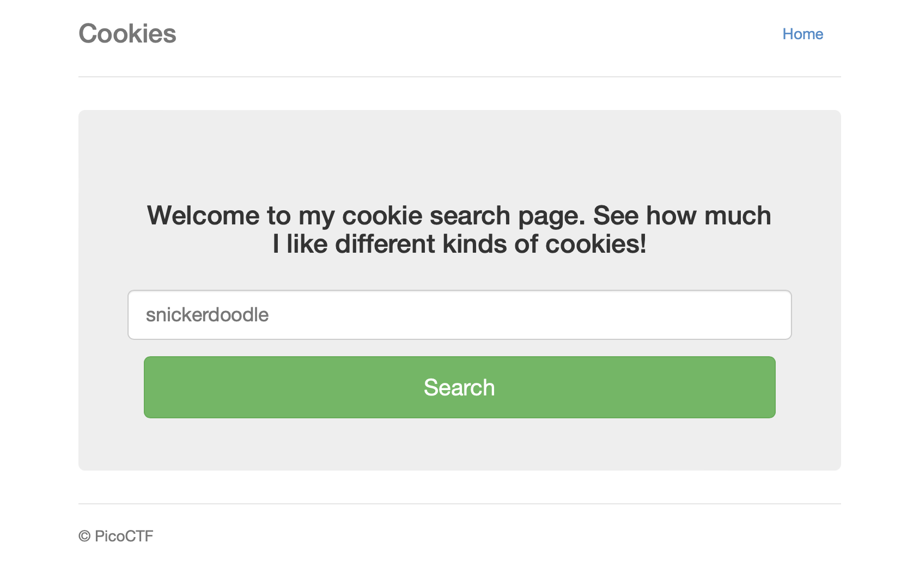

# Cookies
> Web Exploitation

### Description
> Who doesn't love cookies? Try to figure out the best one.
>
> http://mercury.picoctf.net:27177/
>
> **Hint 1: N/A

### Solution
From the description alone, it seems this challenge is focused on determining the right cookie value to retrieve the flag. Let's take a look. Connecting to the given URL shows the following:

Interacting with it and viewing network activity through developer tools, we can see that when entering a type of cookie, our request gets sent through both a "search" and a "check". Search seems to be where the cookie type is checked before it's sent off to check. Check is also where it seems to return different output based on the cookie type, if valid, and sets the cookie `name` accordingly.

It's here that we can see different types of cookies have different browser cookie values (e.g., snickerdoodle is `name=0`, etc). Copying this request to `/check` as a cURL command, we can manually increment the cookie value from 0 and check, one-by-one, the different responses. Eventually we hit `name=18`, where we get our flag.

### Flag
`picoCTF{3v3ry1_l0v3s_c00k135_064663be}`
