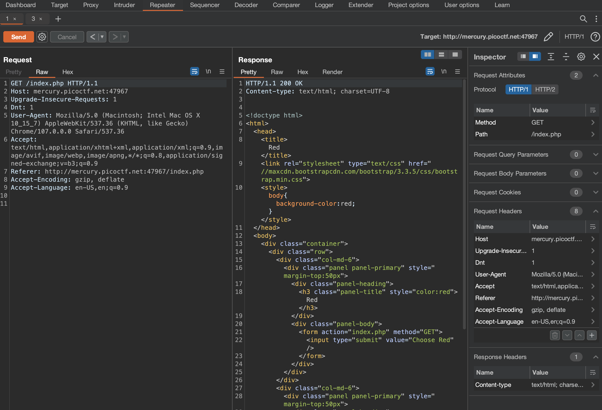

# GET aHEAD
> Web Exploitation

### Description
> Find the flag being held on this server to get ahead of the competition.
>
> http://mercury.picoctf.net:47967/
>
> **Hint 1: Maybe you have more than 2 choices.**
>
> **Hint 2: Check out tools like Burpsuite to modify your requests and look at the responses.**

### Solution
First things first, we can head to the given link and see what we're up against:

It's a red page with 2 buttons: one for red and one for blue. Clicking on either button changes the background page color to, you guessed it, either red or blue. Taking a look at the page source in developer tools doesn't yield anything, but perhaps we can use burp suite to see what the requests and responses look like.

Clicking on the red button gives the following request/response pair:

Clicking on the blue button gives the following request/response pair:

Hmm, nothing is sticking out from just the requests/responses. There aren't any cookies to modify or parameters being passed around. Let's take a step back and think about this for a moment. This is a beginner friendly challenge, so it's safe to assume we don't need to craft any exploits or use any payloads. Looking at the screenshots above, it does seem that there are different HTTP actions (POST/GET) used between the 2 buttons.

Let's consider the title of the challenge: "GET aHEAD". We know GET is an HTTP request. We also know GET is being used by one of the buttons and that POST is also being used. Perhaps HEAD is another HTTP request the challenge is trying to get us to use?

Looking up HTTP methods it appears HEAD is, in fact, a valid method.
> The HTTP HEAD method **requests the headers that would be returned if the HEAD request's URL was instead requested with the HTTP GET method.** For example, if a URL might produce a large download, a HEAD request could read its Content-Length header to check the filesize without actually downloading the file.

It seems that HEAD can act as a sort of "preview" for the GET method, returning any headers associated with a GET request. Perhaps there are some hidden headers we can return?

Let's modify the request to use the HEAD method and see what happens:

And what-do-ya-know, there's the flag!

### Flag
`picoCTF{r3j3ct_th3_du4l1ty_cca66bd3}`
